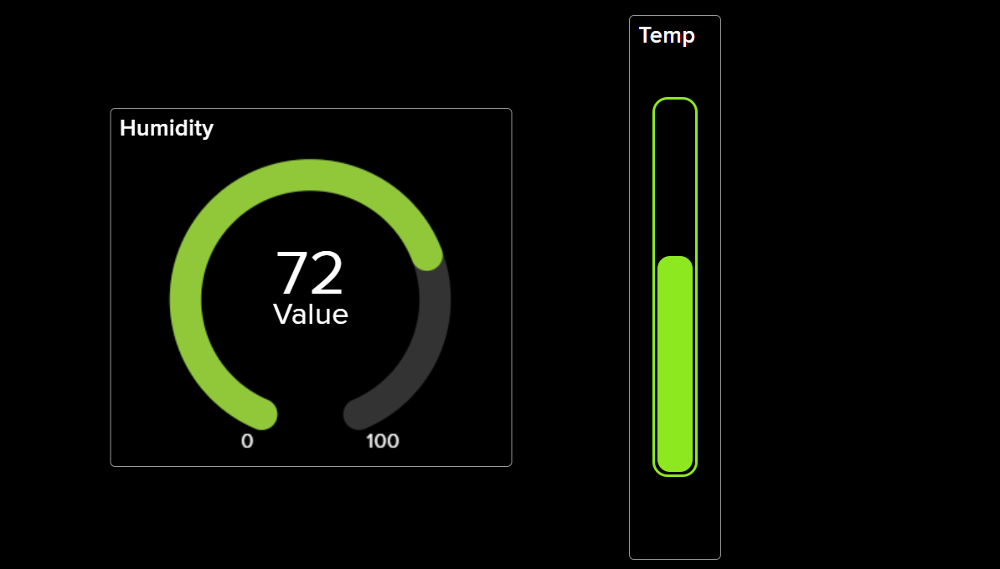

# SP8266 Temperature & Humidity Logger with Adafruit IO

This project uses an ESP8266 microcontroller to read temperature and humidity data from a sensor and publish it to Adafruit IO Cloud.

You can view the data in real-time on your Adafruit IO dashboard.

## Features

- Reads temperature and humidity from a DHT11 sensor.
- Connects to Wi-Fi.
- Publishes data to Adafruit IO feeds via MQTT.
- Easy-to-follow setup and wiring.

## Hardware Requirements

- ESP8266 board
- DHT11 temperature & humidity sensor
- Jumper wires

## Software Requirements

- Arduino IDE
- ESP8266 Board Support for Arduino
- Libraries: DHT, PubSubClient

## Wiring
Wiring

| DHT Pin | ESP8266 Pin |
|---------|-------------|
| VCC     | 3.3V        |
| GND     | GND         |
| DATA    | D4 (GPIO2)  |

## Adafruit IO Configuration

1. **Create an Adafruit IO Account:**  
   Sign up at [io.adafruit.com](https://io.adafruit.com/) if you don't already have an account.

2. **Obtain Your Adafruit IO Key and Username:**  
   - Go to your Adafruit IO dashboard.
   - Click on your profile icon (top right) and select "API Key".
   - Copy your **Username** and **Active Key**.

3. **Create Feeds:**  
   - In Adafruit IO, go to "Feeds" and create two new feeds:
     - `temperature`
     - `humidity`

4. **(Optional) Create a Dashboard:**  
   - Go to "Dashboards" and create a new dashboard.
   - Add blocks to display your temperature and humidity feeds.

## Setup Instructions

1. **Clone this repository:**
    ```sh
    git clone https://github.com/your-username/esp8266-adafruit-logger.git
    cd esp8266-adafruit-logger
    ```

2. **Open the `.ino` file in Arduino IDE.**

3. **Install ESP8266 Board Support:**
    - Go to `File > Preferences`
    - In "Additional Board Manager URLs", add:  
      `http://arduino.esp8266.com/stable/package_esp8266com_index.json`
    - Go to `Tools > Board > Boards Manager`, search for "ESP8266", and install.

4. **Install Required Libraries:**
    - Go to `Tools > Manage Libraries`
    - Search for and install:
        - `DHT11`
        - `PubSubClient`

5. **Update Wi-Fi and Adafruit IO Credentials in the code:**
    ```cpp
    // WiFi settings
    const char *ssid = "YOUR_WIFI_SSID";
    const char *password = "YOUR_WIFI_PASSWORD";

    #define AIO_USERNAME    "YOUR_ADAFRUIT_IO_USERNAME"
    #define AIO_KEY         "YOUR_ADAFRUIT_IO_KEY"

    // MQTT Broker settings
    const char *mqtt_broker = "io.adafruit.com";
    const char *mqtt_topic_temp = "YOUR_USERNAME/feeds/temperature";
    const char *mqtt_topic_hum = "YOUR_USERNAME/feeds/humidity";
    const int mqtt_port = 1883;
    ```

6. **Connect your DHT11 sensor to the ESP8266 as shown above.**

7. **Upload the code to your ESP8266.**

8. **Open the Serial Monitor** (baud rate: 115200) to check connection and publishing status.

9. **Log in to Adafruit IO** and view your feeds or dashboard for live data.
