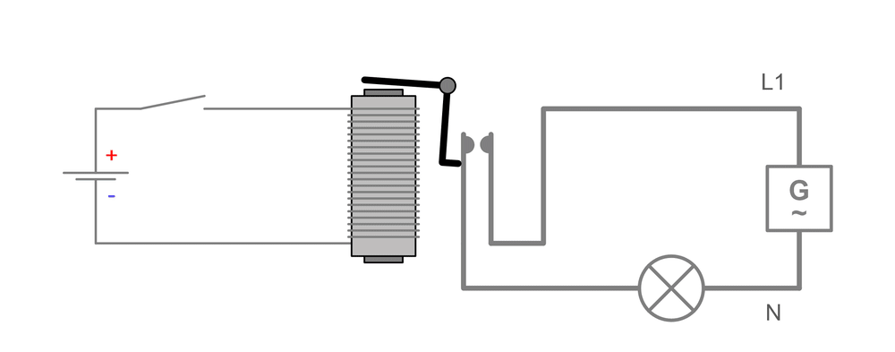
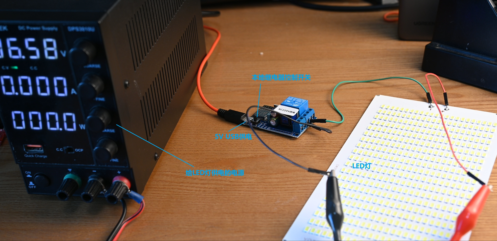
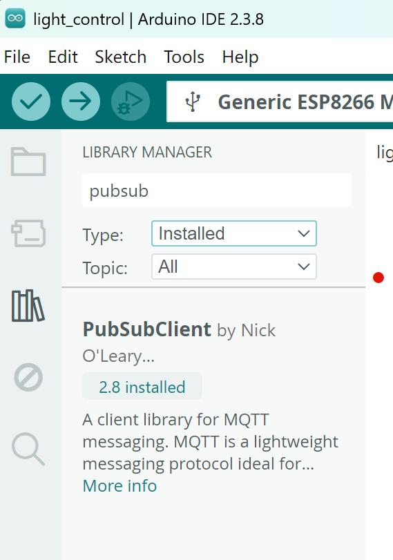
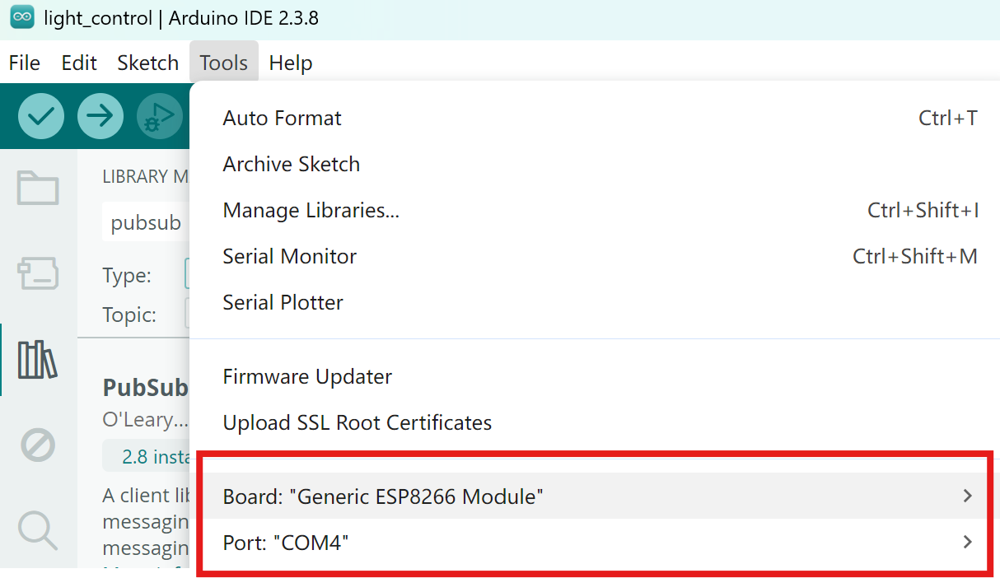
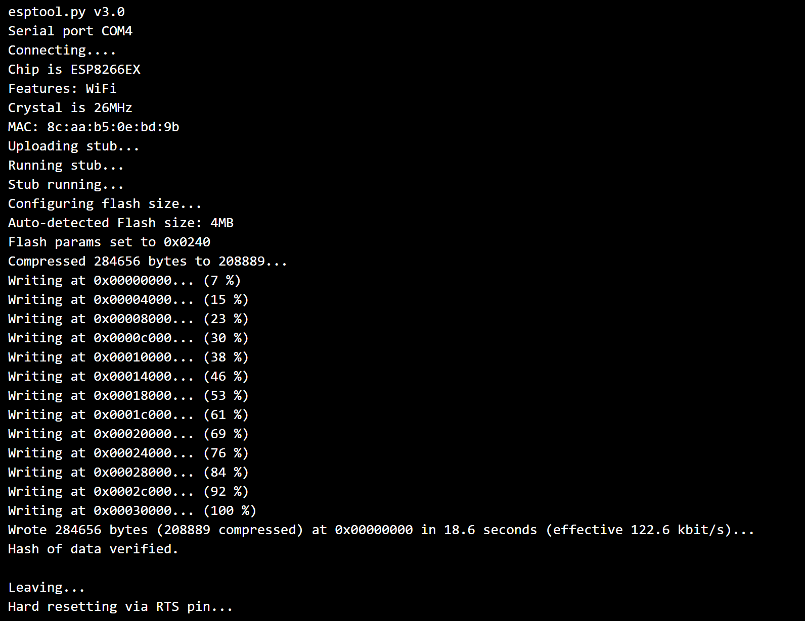
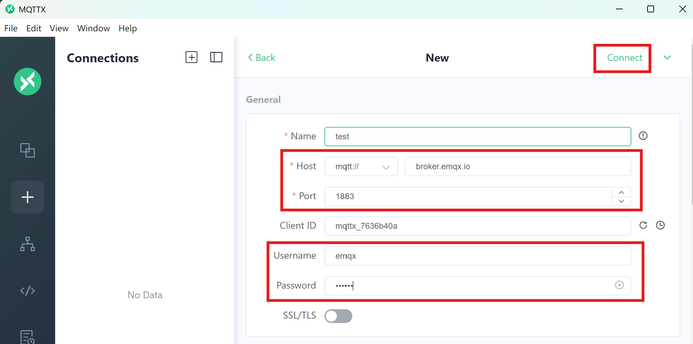
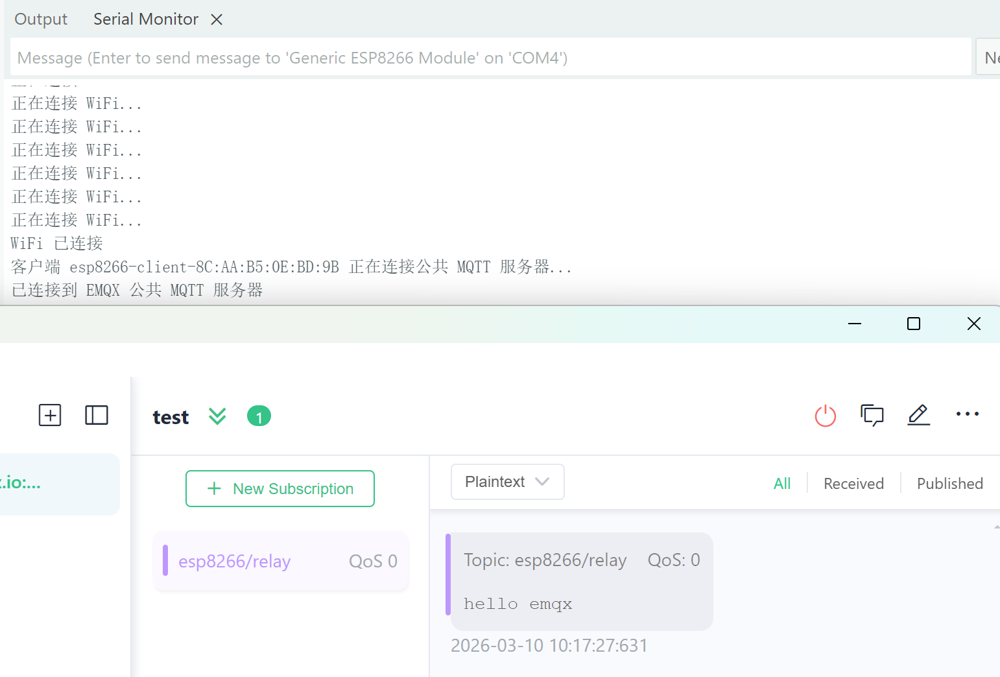
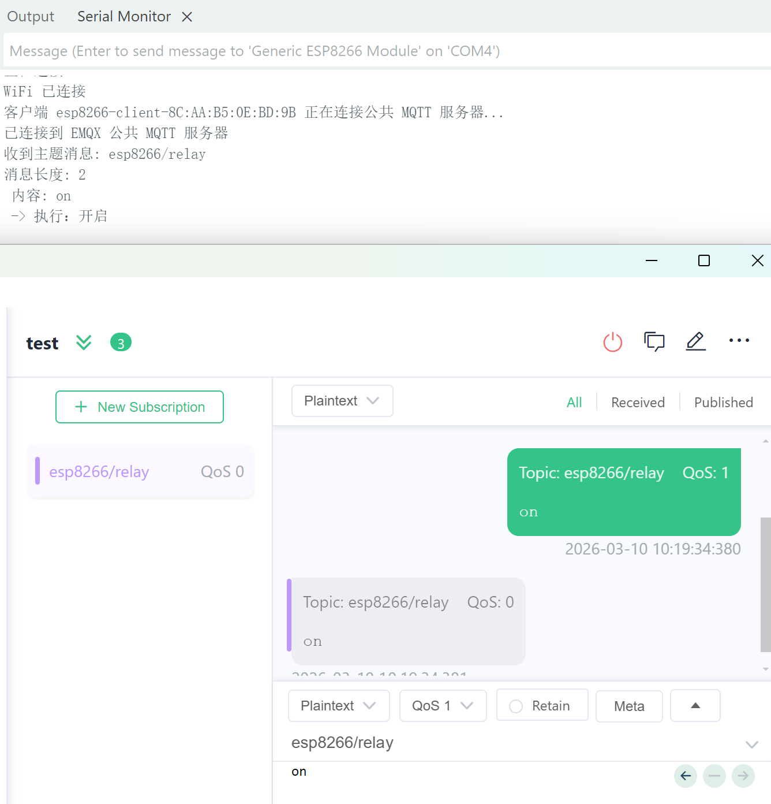

# ESP8266 继电器开关 + MQTT 远程控制 LED 灯

继电器是一种电控开关。
在电路中，它就像一个自动开关：通过一个较小的控制电流，可以控制另一个较大电流的电路。

利用继电器，我们可以让 低功率的控制电路（如 ESP8266）控制高功率设备（灯、电机等）。

本文通过一个简单的例子，演示如何使用 ESP8266 继电器开关 + MQTT 实现 远程控制 LED 灯的开关。


## 1 继电器工作原理

下图是一个继电器控制灯开关的示意图。

当电流通过继电器的线圈时，会产生磁场，磁场吸引衔铁，使可动触点发生移动，从而改变触点状态。

如果触点闭合，灯泡电路导通，灯就会被点亮。



简单理解：

- 线圈通电 → 触点闭合 → 灯亮
- 线圈断电 → 触点断开 → 灯灭

## 2 本地控制

我买了一块 ESP8266 继电器模块，模块自带：

- 5V USB供电接口（给 ESP8266 供电）
- 一个继电器
- 一个本地控制按钮

我们将 LED灯和电源接入继电器的常开（NO）回路。

这样：

- 按下模块上的按钮
- 继电器吸合
- LED 灯点亮

连线如下：



## 3 远程控制 (MQTT)

接下来通过 MQTT 协议实现远程控制。

控制逻辑：

- ESP8266 连接 WiFi
- 连接 MQTT Broker
- 订阅控制主题
- 如果收到 "on" → 打开继电器
- 如果收到 "off" → 关闭继电器

### 工程配置

- 下载 ESP8266 Arduino Core

参考教程：
```http
https://arduino-esp8266.readthedocs.io/en/latest/installing.html#boards-manager
```

- 下载PubSubClient库



- 选择开发板和串口Port



## 4 Arduino代码示例

```arduino
#include <ESP8266WiFi.h>
#include <PubSubClient.h>

// 定义继电器连接的引脚为 GPIO 4
#define RELAY 4

// WiFi 配置
const char *ssid = "";        // 输入你的 WiFi 名称
const char *password = "";    // 输入 WiFi 密码

// MQTT 服务器配置
const char *mqtt_broker = "broker.emqx.io";
const char *topic = "esp8266/relay";
const char *mqtt_username = "emqx";
const char *mqtt_password = "public";
const int mqtt_port = 1883;

bool relayState = false; // 记录继电器状态

WiFiClient espClient;
PubSubClient client(espClient);

void setup() {
    // 设置串口波特率为 9600
    Serial.begin(9600);
    delay(1000); // 等待系统稳定

    // 连接 WiFi 网络
    WiFi.begin(ssid, password);
    while (WiFi.status() != WL_CONNECTED) {
        delay(500);
        Serial.println("正在连接 WiFi...");
    }
    Serial.println("WiFi 已连接");

    // 设置继电器引脚为输出模式
    pinMode(RELAY, OUTPUT);
    digitalWrite(RELAY, LOW);  // 初始状态关闭继电器（或 LED）

    // 设置 MQTT 服务器并配置回调函数
    client.setServer(mqtt_broker, mqtt_port);
    client.setCallback(callback);

    // 循环直到连接上 MQTT 服务器
    while (!client.connected()) {
        String client_id = "esp8266-client-";
        client_id += String(WiFi.macAddress());
        Serial.printf("客户端 %s 正在连接公共 MQTT 服务器...\n", client_id.c_str());
        
        if (client.connect(client_id.c_str(), mqtt_username, mqtt_password)) {
            Serial.println("已连接到 EMQX 公共 MQTT 服务器");
        } else {
            Serial.print("连接失败，错误状态码：");
            Serial.print(client.state());
            delay(2000);
        }
    }

    // 发布初始消息并订阅主题
    client.publish(topic, "hello emqx");
    client.subscribe(topic);
}

// 收到 MQTT 消息时的回调函数
void callback(char *topic, byte *payload, unsigned int length) {
    Serial.print("收到主题消息: ");
    Serial.println(topic);
    Serial.print("消息长度: ");
    Serial.println(length);
    Serial.print(" 内容: ");
    
    String message;
    for (int i = 0; i < length; i++) {
        message += (char) payload[i];  // 将字节数据转换为字符串
    }

    Serial.println(message);

    // 如果收到 "on" 且当前是关闭状态，则开启继电器
    if ((message == "on") && !relayState) {
        digitalWrite(RELAY, HIGH);  // 开启继电器（点亮）
        relayState = true;
        Serial.println(" -> 执行：开启");
    }
    // 如果收到 "off" 且当前是开启状态，则关闭继电器
    if ((message == "off") && relayState) {
        digitalWrite(RELAY, LOW); // 关闭继电器（熄灭）
        relayState = false;
        Serial.println(" -> 执行：关闭");
    }
    Serial.println();
    Serial.println("-----------------------");
}

void loop() {
    // 保持 MQTT 客户端的心跳处理
    client.loop();
    delay(100); // 每次循环轻微延迟
}
```

## 5 下载程序

这块板子的调试接口是 串口，因此需要一根 USB转串口线。


连接方式：
- RXD → TXD
- TXD → RXD
- GND → GND

注意：

下载程序时需要进入 烧录模式。

方法：
- 将 IO0（GPIO0）和 GND 短接
- 按 Reset 重启

如果没有 Reset 按键，可以 重新插拔 USB 电源。

下载成功后串口输出：



## 6 MQTT通信测试

这里使用 MQTTX 工具进行测试。

- 创建 MQTT 连接，订阅主题



- 观察设备上线

重启 ESP8266 后，可以看到串口输出连接成功信息。

ESP 会向主题“esp8266/relay”发送消息“hello emqx”。



- 控制LED灯

向主题发送“on”，ESP8266收到消息后，打开继电器，LED灯点亮。

